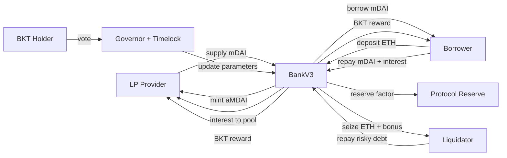

# MiniBank 專案角色與流程導覽

這份文件的目標是讓第一次接觸 MiniBank 的人，可以快速理解這個專案在做什麼、每個角色做什麼、資金怎麼流動、以及 demo 時應該怎麼介紹。

MiniBank 是一個 DeFi lending protocol prototype。它模擬 Aave / Compound 類借貸協議的核心機制：有人提供資金，有人抵押資產借款，當借款人風險過高時會被清算，協議會分配利息、獎勵與治理權。

## 一句話說明

MiniBank 讓 LP 存入 mDAI 提供流動性，Borrower 抵押 ETH 借出 mDAI，Liquidator 在 borrower 風險過高時代還債務並取得 ETH bonus，而 DAO 透過 BKT 治理協議參數。

## 專案在解決什麼問題

傳統借貸需要銀行或平台負責保管抵押品、審核借款人、計算利息與處理違約。DeFi lending 則把這些規則寫進 smart contract，由鏈上狀態自動判斷：

| 問題 | MiniBank 的處理方式 |
| --- | --- |
| 誰可以借錢 | 有抵押 ETH 的使用者可以借 mDAI |
| 可以借多少 | 依 ETH 價格與 LTV 計算可借額度 |
| 利息怎麼算 | 依借款本金、利率與時間累積 |
| LP 怎麼拿收益 | 借款人還款時，部分利息進入流動池 |
| 風險太高怎麼辦 | Health Factor 低於 1 時可以被清算 |
| 協議參數誰決定 | BKT 持有人透過 Governor + Timelock 治理 |

## 核心資產

| 資產 | 用途 | 對應合約 |
| --- | --- | --- |
| ETH | Borrower 的抵押品，也是 Liquidator 清算後取得的資產 | [`BankV3.sol`](contracts/BankV3.sol) 接收與保管 |
| mDAI | 本地測試用穩定幣，LP 存入、Borrower 借出、Repay 與 Liquidation 使用 | [`MiniDAI.sol`](contracts/MiniDAI.sol) |
| aMDAI | LP share token，代表 LP 在流動池中的份額 | [`aMDAI.sol`](contracts/aMDAI.sol) |
| BKT | Reward token 與 governance token | [`BankToken.sol`](contracts/BankToken.sol) |

## 核心角色總覽

| 角色 | 做什麼 | 主要收益 | 主要風險 |
| --- | --- | --- | --- |
| LP Provider | 存入 mDAI，提供借款流動性 | 利息收入、BKT reward | 流動性不足、協議風險 |
| Borrower | 抵押 ETH，借出 mDAI | 取得資金使用權、BKT reward | 支付利息、ETH 價格下跌後被清算 |
| Liquidator | 幫高風險 borrower 還 mDAI | 取得 ETH collateral + liquidation bonus | 需要先準備 mDAI，需承擔交易成本 |
| Protocol | 管理資金池、債務、reserve 與 reward | 收取 protocol reserve | 參數設計錯誤會影響整體安全 |
| DAO / BKT Holder | 投票調整協議參數 | 間接分享協議成長與治理權 | 錯誤治理可能傷害協議 |
| Oracle Owner | Demo 時調整 ETH 價格 | 不是獲利角色，用於展示清算 | Mock oracle 不適合主網 |

## 全系統資金流



## 角色一：LP Provider

LP 是流動性提供者。他把 mDAI 放進 BankV3 的池子，讓 borrower 可以借走 mDAI。

### LP 為什麼重要

如果沒有 LP，協議裡沒有 mDAI，borrower 就算有 ETH 抵押也借不到錢。LP 是整個 lending market 的資金來源。

### LP 操作流程

1. LP 持有 mDAI。
2. LP approve BankV3 使用自己的 mDAI。
3. LP 呼叫 `supply(amount)`。
4. BankV3 收到 mDAI，增加 `liquidityPool`。
5. BankV3 mint aMDAI 給 LP。
6. LP 之後可呼叫 `redeem(aMDAIAmount)` 贖回 mDAI。
7. LP 可呼叫 `claimReward(true)` 領取 LP 身分的 BKT reward。

### LP 收益來源

| 收益 | 說明 |
| --- | --- |
| 利息收入 | Borrower 還款時，扣掉 protocol reserve 後，利息會進入流動池 |
| BKT reward | 系統依 LP 的 supply amount 與時間累積 BKT |
| aMDAI share 增值 | 如果 pool 因利息增加，aMDAI 對應可贖回的 mDAI 也會提高 |

### LP 相關合約邏輯

| 功能 | 函式 |
| --- | --- |
| 存入 mDAI | `supply(uint256 amount)` |
| 贖回 mDAI | `redeem(uint256 amount)` |
| 查 LP 資訊 | `getLPInfo(address user)` |
| 查 exchange rate | `getExchangeRate()` |
| 領 BKT | `claimReward(true)` |

### Demo 時可以這樣講

LP 就像銀行的存款端。Account #1 把 5,000 mDAI 存進協議，協議 mint aMDAI 給他。aMDAI 代表他在資金池中的份額，之後借款人還利息時，池子變大，LP 可贖回的 mDAI 也會增加。

## 角色二：Borrower

Borrower 是借款人。他存入 ETH 作為抵押品，根據抵押品價值借出 mDAI。

### Borrower 為什麼重要

Borrower 是利息來源。借款人願意付利息取得 mDAI 流動性，LP 與 protocol 才能獲得收益。

### Borrower 操作流程

1. Borrower 呼叫 `depositCollateral()` 存入 ETH。
2. BankV3 透過 PriceOracle 取得 ETH/USD 價格。
3. 系統依 LTV 計算最大可借額度。
4. Borrower 呼叫 `borrow(amount)` 借出 mDAI。
5. 借款後會產生 principal 與隨時間累積的 interest。
6. Borrower 可呼叫 `repay(amount)` 還款。
7. 若還款後風險足夠低，Borrower 可呼叫 `withdrawCollateral(amount)` 提出部分 ETH。
8. Borrower 可呼叫 `claimReward(false)` 領取借款人身分的 BKT reward。

### Borrower 成本與收益

| 類型 | 說明 |
| --- | --- |
| 收益 | 取得 mDAI 使用權，可用於其他資金操作 |
| 收益 | 依借款本金與時間取得 BKT reward |
| 成本 | 需要支付借款利息 |
| 風險 | ETH 價格下跌或債務增加時，Health Factor 可能低於 1 |
| 風險 | Health Factor 低於 1 後，抵押 ETH 可能被 liquidator 清算 |

### Borrower 相關公式

```text
maxBorrow = collateralValueUSD * LTV
debt = principal + interest
healthFactor = collateralValueUSD * liquidationThreshold / debt
```

在這個專案中，`LTV` 預設是 80%，`LIQUIDATION_THRESHOLD` 預設是 90%。Health Factor 小於 1 代表可以被清算。

### Borrower 相關合約邏輯

| 功能 | 函式 |
| --- | --- |
| 存 ETH 抵押 | `depositCollateral()` |
| 借 mDAI | `borrow(uint256 amount)` |
| 還款 | `repay(uint256 amount)` |
| 提出 ETH | `withdrawCollateral(uint256 amount)` |
| 查帳戶資料 | `getUserAccountData(address user)` |
| 查健康因子 | `getHealthFactor(address user)` |
| 查清算價格 | `getLiquidationPrice(address user)` |
| 領 BKT | `claimReward(false)` |

### Demo 時可以這樣講

Borrower 就像用房子抵押借錢的人，只是在這裡抵押品是 ETH，借出的資產是 mDAI。Account #2 存入 2 ETH，系統根據 ETH 價格與 LTV 算出可借額度，接著借出 1,000 mDAI。前端會顯示他的 debt、可借額度、Health Factor 與清算價格。

## 角色三：Liquidator

Liquidator 是清算人。他負責處理風險過高的 borrower。

### Liquidator 為什麼重要

DeFi lending 沒有中心化催收者，所以需要 liquidator。當 borrower 的抵押品價值不足時，liquidator 代替 borrower 還一部分 mDAI，協議把 borrower 的部分 ETH 抵押品轉給 liquidator。

### Liquidator 操作流程

1. Liquidator 持有 mDAI。
2. Liquidator 在前端 Liquidations 頁面查看可清算帳戶。
3. 系統檢查 borrower 的 `getHealthFactor(user)` 是否小於 1。
4. Liquidator approve BankV3 使用 mDAI。
5. Liquidator 呼叫 `liquidate(user, repayAmount)`。
6. BankV3 收 liquidator 的 mDAI，降低 borrower 債務。
7. BankV3 將 borrower 的部分 ETH 抵押品轉給 liquidator。
8. Protocol reserve 增加，borrower 的 collateral 與 debt 更新。

### Liquidator 收益來源

| 收益 | 說明 |
| --- | --- |
| Liquidation bonus | Liquidator 付出 mDAI 還債，但取得等值加上 bonus 的 ETH 抵押品 |
| 價差機會 | 如果清算取得的 ETH 價值高於支出的 mDAI 與 gas 成本，就有利潤 |

### Liquidator 相關限制

| 限制 | 說明 |
| --- | --- |
| Health Factor | borrower 的 HF 必須小於 1 才能清算 |
| Close factor | 單次最多清算部分債務，專案中為 50% principal |
| Collateral 上限 | 不可拿超過 borrower 實際抵押的 ETH |
| Reserve factor | 清算還款中一部分會進入 protocol reserve |

### Liquidator 相關合約邏輯

| 功能 | 函式 |
| --- | --- |
| 執行清算 | `liquidate(address user, uint256 repayAmount)` |
| 預估最大清算額 | `estimateMaxLiquidate(address user)` |
| 查 borrower 風險 | `getHealthFactor(address user)` |
| 查 borrower 債務 | `getTotalDebt(address user)` |

### Demo 時可以這樣講

Liquidator 是協議的風險清理角色。當 Account #2 的 ETH 抵押品因價格下跌而不足時，Account #3 可以用 mDAI 幫他還債，並拿到 Account #2 的一部分 ETH。因為有 liquidation bonus，Account #3 有誘因主動維護協議安全。

## 角色四：Protocol

Protocol 不是某個單一使用者，而是 BankV3 合約本身。它負責記帳、保管資產、檢查風險、分配收益與執行治理參數。

### Protocol 做的事

| 工作 | 說明 |
| --- | --- |
| 保管 ETH collateral | Borrower 存入 ETH 後，由 BankV3 記錄與保管 |
| 管理 mDAI pool | LP 存入 mDAI，Borrower 從 pool 借出 mDAI |
| 計算 debt | 追蹤 principal 與 interest |
| 分配還款 | 還款拆成 principal reduction、LP income、protocol reserve |
| 執行 liquidation | 檢查 HF，更新債務與抵押品，轉出 seized ETH |
| 發放 BKT reward | LP 與 Borrower 依資金基礎與時間累積 reward |
| 接受 governance 更新 | 由 DAO 調整利率、reward、reserve 等參數 |

### Protocol 收益來源

| 收益 | 說明 |
| --- | --- |
| `protocolTokenReserve` | 還款與清算中依 `reserveFactor` 抽取的 mDAI |
| `protocolETHReserve` | 保留給 ETH 收益儲備的設計欄位 |

### Protocol 相關合約邏輯

| 功能 | 函式 |
| --- | --- |
| 提領 mDAI reserve | `withdrawTokenReserve(address to, uint256 amount)` |
| 提領 ETH reserve | `withdrawETHReserve(address to, uint256 amount)` |
| 將 reserve 注入 LP pool | `injectProtocolEarningsToLP(uint256 amount)` |
| 調整 reserve factor | `setReserveFactor(uint256 newFactor)` |

### Demo 時可以這樣講

Protocol 是整個系統的會計與規則執行者。它不是只做轉帳，而是會檢查 LTV、Health Factor、清算條件、利息拆分、LP share、BKT reward 與 governance 權限。

## 角色五：DAO / BKT Holder

DAO 是治理角色。BKT 持有人可以把投票權 delegate 給自己，然後提出或投票支持協議參數更新。

### DAO 為什麼重要

DeFi 協議中的利率、reserve factor、reward emission 與 debt cap 會影響所有使用者。如果這些參數由單一管理者任意修改，會有中心化風險。MiniBank 使用 Governor + Timelock 讓參數調整經過提案、投票、排程與延遲執行。

### DAO 操作流程

1. BKT holder 持有 BKT。
2. BKT holder 呼叫 delegate，把 voting power 委託給自己或其他地址。
3. 達到 proposal threshold 後，可以建立 proposal。
4. 經過 voting delay 後進入投票期。
5. BKT holder 投票支持、反對或棄權。
6. 投票期結束且達到 quorum 後，proposal 可以 queue。
7. Timelock delay 結束後，proposal 可以 execute。
8. BankV3 或 Governor 的參數被正式更新。

### DAO 可以調整的參數

| 參數 | 影響 |
| --- | --- |
| `interestRate` | Borrower 要付的利息，影響 LP 收益與借款需求 |
| `reserveFactor` | Protocol 從利息中抽取的比例 |
| `dailyCap` | 每日最多可發出的 BKT reward |
| `lpRewardRatio` | LP 的 BKT reward 速度 |
| `borrowerRewardRatio` | Borrower 的 BKT reward 速度 |
| `maxTotalDebt` | 全協議最大總債務上限 |
| `proposalThresholdBKT` | 發起提案需要的 BKT 門檻 |
| `quorumPercent` | 提案通過需要的最低參與比例 |

### DAO 相關合約邏輯

| 功能 | 合約 / 函式 |
| --- | --- |
| 投票權 token | [`BankToken.sol`](contracts/BankToken.sol) |
| 建立提案與投票 | [`BankGovernor.sol`](contracts/BankGovernor.sol) |
| 延遲執行 | [`BankTimelock.sol`](contracts/BankTimelock.sol) |
| 更新 Bank 參數 | [`BankV3.sol`](contracts/BankV3.sol) 的 `onlyGovernance` 函式 |

### Demo 時可以這樣講

DAO 是協議的管理層，但不是直接由 deployer 私下改參數。Account #0 先 delegate BKT voting power，建立調整利率的提案，經過投票、queue 與 timelock 後才 execute。這展示了 DeFi protocol 常見的治理流程。

## 角色六：Oracle Owner

Oracle Owner 在這個專案中主要是 demo 角色，負責改變 mock ETH price 來展示風險與清算。

### Oracle Owner 操作流程

1. Account #0 是本地 PriceOracle 的 owner。
2. Demo 時先讓 borrower 正常抵押與借款。
3. Account #0 呼叫 `setPrice()` 調低 ETH 價格。
4. Borrower 的 collateral value 下降。
5. Health Factor 低於 1 後，Liquidator 可以清算。

### Demo 時可以這樣講

正式 DeFi 協議通常會使用 Chainlink 或其他去中心化 oracle。本專案為了本地展示，使用 owner 可調的 mock oracle，方便模擬 ETH 價格下跌並觸發 liquidation。

## 主要流程總整理

### 流程 A：LP 供應資金

```text
LP 有 mDAI
LP approve BankV3
LP supply mDAI
BankV3 mint aMDAI
liquidityPool 增加
Borrower 可以借款
```

### 流程 B：Borrower 抵押借款

```text
Borrower deposit ETH
Oracle 提供 ETH price
BankV3 計算 collateral value
BankV3 檢查 LTV
Borrower borrow mDAI
debt 開始累積利息
```

### 流程 C：Borrower 還款

```text
Borrower approve mDAI
Borrower repay mDAI
BankV3 計算 principal + interest
本金部分降低 debt
利息部分分給 LP pool
reserveFactor 部分進 protocol reserve
```

### 流程 D：價格下跌與清算

```text
Oracle price 下跌
Borrower collateral value 下降
Health Factor 低於 1
Liquidator repay 部分 debt
BankV3 seize borrower ETH
Liquidator 拿到 ETH + bonus
Borrower debt 與 collateral 下降
```

### 流程 E：BKT Reward

```text
LP supply 或 Borrower borrow
時間經過
BankV3 依 amount、ratio、time 計算 reward
受 dailyCap 限制
使用者 claim BKT
BKT 可作為治理投票權
```

### 流程 F：DAO Governance

```text
BKT holder delegate votes
建立 proposal
等待 voting delay
投票
投票期結束
queue 到 Timelock
等待 timelock delay
execute
協議參數更新
```

## 建議 Demo 帳號分工

| 帳號 | 角色 | 建議操作 |
| --- | --- | --- |
| Account #0 | Deployer、Oracle Owner、DAO voter | 部署、改 oracle 價格、delegate、proposal、vote、queue、execute |
| Account #1 | LP Provider | supply 5,000 mDAI、查看 aMDAI、claim LP reward |
| Account #2 | Borrower | deposit 2 ETH、borrow 1,000 mDAI、repay、查看 Health Factor |
| Account #3 | Liquidator | approve mDAI、liquidate Account #2 |

## 推薦展示順序

1. 用 Overview 說明這是一個 lending protocol，不只是單純 token transfer DApp。
2. 切 Account #1，展示 LP supply mDAI，取得 aMDAI。
3. 切 Account #2，展示 ETH collateral 與 borrow mDAI。
4. 在 Portfolio / Risk 說明 LTV、Debt、Health Factor、Liquidation Price。
5. 讓 Account #2 repay 100 mDAI，說明還款拆成本金、LP 收益、protocol reserve。
6. 用 Account #0 調低 ETH 價格，展示 borrower 風險上升。
7. 切 Account #3，執行 liquidation，說明清算人為何有獲利誘因。
8. Account #1 與 Account #2 claim BKT reward，說明 reward emission。
9. Account #0 執行 DAO proposal flow，說明協議參數不是直接私下改，而是透過 governance。
10. 最後到 Parameters 與 Analytics 看參數與事件紀錄。

## 前端頁面怎麼看

| 頁面 | 適合介紹什麼 |
| --- | --- |
| Overview | 協議總覽、總流動性、總借款、reserve、利率 |
| Markets | ETH/mDAI 市場、LTV、清算門檻、bonus、reserve factor |
| Portfolio | 個人抵押品、債務、可借額度、可提款額度 |
| Risk | Health Factor、清算價格、風險狀態 |
| Liquidations | 可清算帳戶、max repay、執行 liquidation |
| Governance | delegate、proposal、vote、queue、execute |
| Analytics | 最近事件與協議活動紀錄 |
| Parameters | 目前治理參數與是否可治理 |

## 合約模組怎麼分工

| 合約 | 負責內容 |
| --- | --- |
| [`BankV3.sol`](contracts/BankV3.sol) | 核心借貸、LP pool、collateral、debt、interest、liquidation、reward、reserve、governance parameters |
| [`MiniDAI.sol`](contracts/MiniDAI.sol) | 本地測試用穩定幣 mDAI |
| [`aMDAI.sol`](contracts/aMDAI.sol) | LP share token，只能由 BankV3 mint / burn |
| [`BankToken.sol`](contracts/BankToken.sol) | BKT reward 與 governance token，支援 ERC20Votes |
| [`BankGovernor.sol`](contracts/BankGovernor.sol) | DAO proposal、vote、queue、execute 流程 |
| [`BankTimelock.sol`](contracts/BankTimelock.sol) | 治理執行前的延遲控制 |
| [`PriceOracle.sol`](contracts/PriceOracle.sol) | 本地 demo 用 ETH/USD price feed |

## 收益與風險一句話版

| 角色 | 一句話 |
| --- | --- |
| LP | 我提供 mDAI 給別人借，賺利息與 BKT，但要承擔協議風險 |
| Borrower | 我抵押 ETH 借 mDAI，拿到資金與 BKT，但要付利息且可能被清算 |
| Liquidator | 我幫壞帳邊緣的帳戶還債，換取折價加 bonus 的 ETH |
| Protocol | 我從利息和清算中抽 reserve，作為協議收入 |
| DAO | 我用 BKT 投票調整參數，影響協議風險與收益分配 |

## 專案亮點

| 亮點 | 說明 |
| --- | --- |
| 完整 lending flow | 從 LP supply、borrow、repay 到 liquidation 都有實作 |
| 風險模型清楚 | 使用 LTV、Health Factor、Liquidation Threshold、Bonus、Reserve Factor |
| 有 reward emission | LP 與 Borrower 都能依資金基礎與時間累積 BKT |
| 有 DAO governance | 使用 ERC20Votes、Governor、Timelock 展示參數治理 |
| 有前端 console | 可直接用 MetaMask 操作與觀察協議狀態 |
| 有測試覆蓋 | Hardhat tests 覆蓋主要角色與完整流程 |

## 專案限制

MiniBank 是 prototype，不是可直接上主網處理真實資金的產品。

| 限制 | 說明 |
| --- | --- |
| 單一資產 | 只支援 ETH collateral 與 mDAI borrow |
| Mock oracle | 價格由 owner 調整，適合 demo，不適合主網 |
| 固定利率 | 尚未使用 utilization-based interest rate |
| 簡化 LP 會計 | 使用 aMDAI share 與 pool exchange rate，尚未升級到成熟協議的 index accounting |
| Demo governance | voting period 與 timelock delay 為本地展示設計 |

## 評審可以怎麼理解這個專案

這個專案的重點不是做一個簡單前端，也不是只發 ERC20 token。MiniBank 展示的是 DeFi lending protocol 的核心邏輯：

1. LP 提供資金。
2. Borrower 抵押借款。
3. Interest 產生並分配給 LP 與 protocol。
4. Oracle 價格變動會影響風險。
5. Health Factor 低於門檻會觸發 liquidation。
6. Liquidator 有經濟誘因維護協議安全。
7. BKT reward 用來激勵使用者與提供治理權。
8. DAO 透過 Governor + Timelock 調整參數。

如果要用一句比較正式的方式介紹：

```text
MiniBank is a production-like DeFi lending protocol prototype that demonstrates collateralized borrowing, LP liquidity, interest distribution, liquidation incentives, reward emission, and DAO-governed risk parameters.
```
