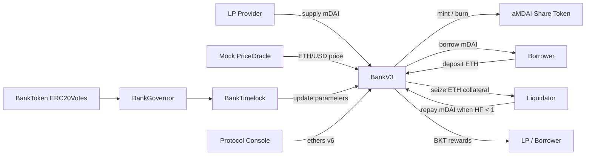

# MiniBank DeFi Lending Protocol

MiniBank 是一個以 Hardhat 建置的 DeFi 借貸協議 prototype。專案模擬 Aave / Compound 類借貸系統的核心流程，包含 ETH 抵押、mDAI 借款、LP 流動性池、利息分配、清算、BKT 獎勵、DAO governance 與前端 protocol console。

本專案定位為 production-like prototype，用於展示區塊鏈金融協議設計、smart contract 工程能力、測試與前端整合能力。它不是主網可用產品，不應處理真實資金。

## 專案亮點

| 類別 | 內容 |
| --- | --- |
| DeFi lending | 實作 ETH 抵押、mDAI 借款、health factor、清算與 protocol reserve |
| LP pool | LP 供應 mDAI，取得 aMDAI share，依 pool/share 比例 redeem |
| Reward emission | LP 與 Borrower 依時間與資金基礎累積 BKT，並有 daily cap |
| DAO governance | BKT 使用 ERC20Votes，透過 Governor + Timelock 調整協議參數 |
| Frontend console | 提供 Overview、Markets、Portfolio、Risk、Liquidations、Governance、Analytics、Parameters 分頁 |
| Engineering quality | 使用 ReentrancyGuard、SafeERC20、ETH call、Timelock admin revoke、完整 Hardhat tests |
| Documentation | README、Demo Flow、Diagnostic Report、Portfolio Write-up、Presentation Checklist |

## 作品定位

這個專案的目標不是複製完整 Aave 或 Compound，而是把 DeFi lending protocol 最核心的資產流與風險控制做成一個可執行、可測試、可展示的完整系統。

適合作為推甄研究所作品的原因：

| 面向 | 展示能力 |
| --- | --- |
| 區塊鏈實作 | Solidity、ERC20、DAO governance、Timelock、Hardhat deployment |
| 金融協議理解 | LTV、health factor、liquidation threshold、reserve factor、interest accrual |
| 工程完整性 | 合約、測試、部署腳本、前端、文件與展示流程完整串接 |
| 風險意識 | 明確揭露 mock oracle、固定利率、單一資產、demo governance 等限制 |
| 後續研究性 | 可延伸到 utilization-based rate、index accounting、多資產、oracle security、fuzz testing |

## 系統架構



## 合約一覽

| 合約 | 角色 |
| --- | --- |
| `contracts/BankV3.sol` | 核心協議，處理抵押、借款、還款、清算、LP、reward、reserve 與治理參數 |
| `contracts/MiniDAI.sol` | 本地測試用穩定幣 mDAI，owner 或 minter 可 mint |
| `contracts/aMDAI.sol` | LP share token，只有 BankV3 可以 mint / burn |
| `contracts/BankToken.sol` | BKT governance / reward token，基於 OpenZeppelin ERC20Votes |
| `contracts/BankGovernor.sol` | DAO 提案、投票、queue、execute 流程 |
| `contracts/BankTimelock.sol` | TimelockController 包裝，治理操作需延遲執行 |
| `contracts/PriceOracle.sol` | 本地測試用 Mock ETH/USD oracle，owner 可手動餵價以展示清算 |

## 核心流程

### LP 流動性

LP 持有 mDAI，先 approve BankV3，再呼叫 `supply(amount)`。BankV3 會收取 mDAI 並 mint aMDAI 給 LP，aMDAI 代表 LP 在池子中的 share。

Redeem 時，LP 呼叫 `redeem(aMDAIAmount)`，系統依 `liquidityPool / totalAMDAI` 計算可贖回的 mDAI。

### 抵押與借款

Borrower 呼叫 `depositCollateral()` 存入 ETH，系統透過 oracle 取得 ETH/USD 價格，依 LTV 計算可借額度。

借款時呼叫 `borrow(amount)`，需滿足：

```text
debt + amount <= collateralValue * LTV
amount <= liquidityPool
```

### 利息與還款

債務由 principal 與依時間累積的 interest 組成。還款時呼叫 `repay(amount)`，系統會把還款拆分為：

| 去向 | 說明 |
| --- | --- |
| Principal reduction | 扣除借款本金 |
| LP income | 利息中分配給流動性池的部分 |
| Protocol reserve | 依 reserveFactor 抽成，累積為協議收益 |

### 清算

當 borrower 的 health factor 低於 1 時，清算人可以呼叫 `liquidate(user, repayAmount)`。

Health factor 概念：

```text
HF = collateralValue * liquidationThreshold / debt
HF < 1 表示可被清算
```

清算人支付 mDAI 幫 borrower 還債，並取得部分 ETH 抵押品與 liquidation bonus。系統同時更新 borrower debt、collateral、LP pool 與 protocol reserve。

### BKT 獎勵

LP 與 Borrower 會依資金基礎與時間累積 BKT reward。系統設有 dailyCap，避免單日發放量無限制增加。

### DAO Governance

BKT 支援 ERC20Votes。使用者需先 delegate voting power，才能參與治理。治理流程包含：

```text
delegate -> propose -> voting delay -> vote -> voting period -> queue -> timelock delay -> execute
```

可治理參數包含 interest rate、daily cap、reserve factor、reward ratio、max total debt、proposal threshold、quorum percent 等。

## 工程品質與安全設計

| 類別 | 實作 |
| --- | --- |
| Reentrancy 防護 | 涉及資產轉出的函式使用 OpenZeppelin `ReentrancyGuard` |
| ERC20 安全呼叫 | BankV3 使用 `SafeERC20` 處理 mDAI transfer / transferFrom |
| ETH 發送 | 使用 `call{value: amount}("")` 並檢查回傳值，避免 `transfer` gas stipend 問題 |
| Governance 權限 | BankV3 governance 轉交 Timelock，部署腳本授權 Governor 後撤銷 deployer timelock admin |
| Oracle 權限 | Mock oracle 只有 owner 可改價，便於本地展示清算 |
| 風險參數 | LTV、liquidation threshold、bonus、reserve factor、maxTotalDebt 可控 |
| 測試輸出 | 測試預設靜默 debug log，必要時可用 `DEBUG_TESTS=1` 開啟 |

## 前端功能

前端位於 `frontend/`，使用靜態 HTML/CSS/JavaScript 與 ethers v6。

| 頁面 | 功能 |
| --- | --- |
| Overview | 顯示協議總覽、流動性、債務、reserve、利率 |
| Markets | 顯示 ETH/mDAI market 與風險參數 |
| Portfolio | 顯示個人抵押、債務、可借額度、可提款額度 |
| Risk | 顯示 health factor、清算價格與風險狀態 |
| Liquidations | 顯示可清算名單、估算 max repay、執行清算 |
| Governance | delegate、建立提案、投票、queue、execute |
| Analytics | 顯示近期事件與協議活動 |
| Parameters | 顯示可治理參數與目前值 |

前端會檢查 MetaMask 是否在 Hardhat localhost chainId `31337`。一般展示時會關閉 debug log，需要除錯可使用：

```text
http://localhost:3000?debug=1
```

## 安裝與啟動

### 1. 安裝依賴

```bash
npm install
```

### 2. 編譯合約

```bash
npm run compile
```

### 3. 執行測試

```bash
npm test
```

若需要顯示測試 debug log：

```powershell
$env:DEBUG_TESTS="1"; npm test
```

### 4. 啟動 Hardhat 本地鏈

第一個終端機：

```bash
npm run node
```

### 5. 部署合約

第二個終端機：

```bash
npm run deploy:local
```

部署腳本會部署所有合約，初始化權限，分配 BKT，撤銷 deployer timelock admin，並輸出 ABI/address 到 `frontend/`。

### 6. 發放測試 mDAI

```bash
npm run fund:local
```

預設會發 20,000 mDAI 給 Hardhat Account #1 到 #4。

### 7. 啟動前端

```bash
npx serve frontend
```

瀏覽器開啟：

```text
http://localhost:3000
```

MetaMask 設定：

| 欄位 | 值 |
| --- | --- |
| Network | Hardhat Localhost |
| RPC URL | `http://127.0.0.1:8545` |
| Chain ID | `31337` |
| Currency | `ETH` |

## Demo 建議流程

| 帳號 | 用途 |
| --- | --- |
| Account #0 | 部署者、Oracle owner、DAO 提案與投票 |
| Account #1 | LP，供應 mDAI |
| Account #2 | Borrower，抵押 ETH 並借 mDAI |
| Account #3 | Liquidator，清算高風險帳戶 |

建議展示順序：

1. Account #1 supply 5,000 mDAI，取得 aMDAI。
2. Account #2 deposit 2 ETH，borrow 1,000 mDAI。
3. Portfolio / Risk 查看 debt、health factor、liquidation price。
4. Account #2 repay 100 mDAI，展示還款拆分。
5. Account #0 將 ETH 價格調低到 400 USD。
6. Account #3 liquidate Account #2，展示 seized ETH 與 reserve 變化。
7. Account #1 / #2 claim BKT reward。
8. Account #0 delegate BKT votes，建立治理提案。
9. Mine block、投票、queue、快轉 timelock、execute。
10. Parameters 頁確認治理參數更新。

完整展示細節可參考 `DEMO_FLOW.md` 與 `PRESENTATION_CHECKLIST.md`。

## 測試覆蓋

目前測試結果：

```text
24 passing
```

| 測試檔 | 覆蓋內容 |
| --- | --- |
| `test/BankV3-test.js` | 抵押、借款、利息、清算、還款、提款限制 |
| `test/comprehensive-onchain-flow-test.js` | 部署、LP、借款、還款、清算、reward、reserve、DAO governance 完整流程 |
| `test/repay-test.js` | 還款拆分為本金、LP 收益與 protocol reserve |
| `test/lp-supply-test.js` | LP supply、redeem、aMDAI share、reward |
| `test/liquidation-test.js` | 清算成功條件、抵押品轉移、reserve 增加 |
| `test/liquidation-lp-test.js` | 多 LP 情境下的清算與 reward |
| `test/interest-test.js` | 清算時利息、LP pool、reserve 的會計變化 |
| `test/reward-test.js` | Borrower / LP reward 累積與 claim |
| `test/reward-test-liquidation-withdrawal.js` | 清算、提款與 dailyCap 邊界情境 |
| `test/flashLoanMock.js` | 概念式 flash loan liquidation simulation |

## 專案檔案結構

```text
contracts/                    Solidity smart contracts
frontend/                     Static DApp console and exported ABI/address files
scripts/deploy.js             Deploy all contracts and export frontend artifacts
scripts/transferMiniDai.js    Fund local demo accounts with mDAI
scripts/test-*.js             Local demonstration scripts
test/                         Hardhat test suite
DEMO_FLOW.md                  Step-by-step demo script
PROJECT_DIAGNOSTIC_REPORT.md  Technical diagnosis and future roadmap
PORTFOLIO_WRITEUP.md          Portfolio-oriented project explanation
PRESENTATION_CHECKLIST.md     Before-demo checklist and troubleshooting
ADMISSIONS_APPLICATION_GUIDE.md  How to write this project in graduate application materials
```

## 與成熟協議的差異

MiniBank 是 prototype，因此保留一些有意識的簡化：

| 項目 | MiniBank | 成熟 DeFi lending protocol |
| --- | --- | --- |
| 資產種類 | 單一 ETH 抵押、單一 mDAI 借款 | 多抵押品、多借款資產 |
| Oracle | Owner 可調的 mock oracle | Chainlink、TWAP、多重 oracle 與 fallback |
| 利率 | 固定利率，由 governance 調整 | utilization-based dynamic interest rate |
| LP 會計 | aMDAI share + pool exchange rate | index-based accounting |
| Governance | 本地 demo delay / period | 長週期投票、正式 timelock、更多權限隔離 |
| Security | 教學與展示級防護 | 需 audit、fuzzing、formal verification、bug bounty |

這些限制已在文件中揭露，並作為後續研究方向。

## 後續研究方向

| 優先度 | 方向 |
| --- | --- |
| P1 | 將固定利率升級為 utilization-based interest rate model |
| P1 | 使用 index-based accounting 精準處理 borrower debt 與 LP yield |
| P2 | 支援多抵押品與多借款資產，讓風險參數 per-market 化 |
| P2 | 導入 Chainlink / TWAP oracle，加入 staleness 與 deviation checks |
| P3 | 增加 invariant tests、fuzz tests、Slither 靜態分析與安全 checklist |
| P3 | 部署到 Sepolia，驗證合約並 hosting frontend |

## 推甄資料使用方式

如果要把此專案放進研究所推甄資料，建議不要只寫「我做了一個區塊鏈 DApp」。比較好的寫法是強調它是一個完整 DeFi lending protocol prototype，並說明你理解金融協議的風險模型、治理流程與工程驗證。

可直接參考：

```text
ADMISSIONS_APPLICATION_GUIDE.md
```

一句話摘要：

> MiniBank 是一個完整串接 smart contract、DAO governance、測試與前端的 DeFi lending prototype，用來展示我對區塊鏈金融協議設計、風險控制與工程實作的理解。

## 相關文件

| 文件 | 用途 |
| --- | --- |
| `DEMO_FLOW.md` | 完整展示步驟 |
| `PRESENTATION_CHECKLIST.md` | 展示前檢查清單與錯誤排查 |
| `PROJECT_DIAGNOSTIC_REPORT.md` | 專案限制、與成熟協議差異、後續優化方向 |
| `PORTFOLIO_WRITEUP.md` | 作品集用說明 |
| `ADMISSIONS_APPLICATION_GUIDE.md` | 推甄履歷、自傳、讀書計畫與面試寫法 |
